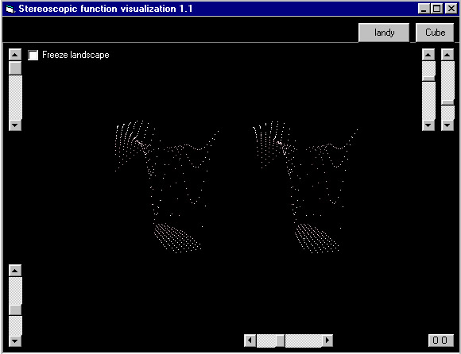



## stereoscopic function visualization 1\.1

### Description

still haven't figured out 'correct' vertical rotation :B
 
### More Info
 

             |
---                |---
**Submitted On**   |2001-08-30 04:24:48
**By**             |[easfw](https://github.com/Planet-Source-Code/PSCIndex/blob/master/ByAuthor/easfw.md)
**Level**          |Intermediate
**User Rating**    |5.0 (35 globes from 7 users)
**Compatibility**  |VB 6\.0
**Category**       |[Graphics](https://github.com/Planet-Source-Code/PSCIndex/blob/master/ByCategory/graphics__1-46.md)
**World**          |[Visual Basic](https://github.com/Planet-Source-Code/PSCIndex/blob/master/ByWorld/visual-basic.md)
**Archive File**   |[stereoscop255928302001\.zip](https://github.com/Planet-Source-Code/easfw-stereoscopic-function-visualization-1-1__1-26296/archive/master.zip)

